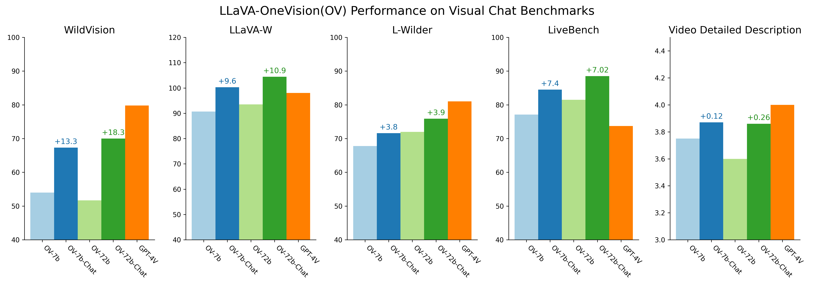

<p align="center" width="100%">

</p>

# LLaVA-NeXT: Open Large Multimodal Models
[](http://arxiv.org/abs/2410.02713)
[](https://arxiv.org/abs/2408.03326)
[](https://llava-vl.github.io/blog/)

[](https://llava-onevision.lmms-lab.com/)
[](https://huggingface.co/spaces/WildVision/vision-arena)
[](https://huggingface.co/spaces/lmms-lab/LLaVA-NeXT-Interleave-Demo)
[](https://openbayes.com/console/public/tutorials/gW0ng9jKXfO)

[](https://huggingface.co/collections/lmms-lab/llava-next-video-661e86f5e8dabc3ff793c944)
[](https://huggingface.co/collections/lmms-lab/llava-onevision-66a259c3526e15166d6bba37)
[](https://huggingface.co/collections/lmms-lab/llava-next-interleave-66763c55c411b340b35873d1)
[](https://huggingface.co/lmms-lab)

## Release Notes

- **[2024/10/04] 🔥 LLaVA-Video** (formerly LLaVA-NeXT-Video) has undergone a major upgrade! We are excited to release **LLaVA-Video-178K**, a high-quality synthetic dataset for video instruction tuning. This dataset includes:

  - 178,510 caption entries
  - 960,792 open-ended Q&A pairs
  - 196,198 multiple-choice Q&A items

  Along with this, we’re also releasing the **LLaVA-Video 7B/72B models**, which deliver competitive performance on the latest video benchmarks, including [Video-MME](https://video-mme.github.io/home_page.html#leaderboard), [LongVideoBench](https://longvideobench.github.io/), and [Dream-1K](https://tarsier-vlm.github.io/).

  📄 **Explore more**:
  - [LLaVA-Video-178K Dataset](https://huggingface.co/datasets/lmms-lab/LLaVA-Video-178K): Download the dataset.
  - [LLaVA-Video Models](https://huggingface.co/collections/lmms-lab/llava-video-661e86f5e8dabc3ff793c944): Access model checkpoints.
  - [Paper](http://arxiv.org/abs/2410.02713): Detailed information about LLaVA-Video.
  - [LLaVA-Video Documentation](https://github.com/LLaVA-VL/LLaVA-NeXT/blob/main/docs/LLaVA_Video_1003.md): Guidance on training, inference and evaluation.

- [2024/09/13] 🔥 **🚀 [LLaVA-OneVision-Chat](docs/LLaVA_OneVision_Chat.md)**. The new LLaVA-OV-Chat (7B/72B) significantly improves the chat experience of LLaVA-OV. 📄
  
  

- [2024/08/06] 🔥 **🚀 [LLaVA-OneVision (OV)](https://llava-vl.github.io/blog/2024-08-05-llava-onevision/)!** The new LLaVA-OV models (0.5B/7B/72B) achieve new state-of-the-art performance across single-image, multi-image, and video benchmarks, sometimes rivaling top commercial models on 47 diverse benchmarks. 📄 Explore More:
  * [[Paper]](https://arxiv.org/abs/2408.03326): In-depth insights, new emegerging scenarios, ie, strong video understadning through task transfer from images.
  * [[LLaVA-OV Doc]](https://github.com/LLaVA-VL/LLaVA-NeXT/blob/main/docs/LLaVA_OneVision.md): Model inference and evaluation guidance.
  * [[Scripts]](https://github.com/LLaVA-VL/LLaVA-NeXT/blob/main/scripts/train): Start training models on your single-image/multi-image/video data.
    
- [2024/07/16] 🔥 **LLaVA-NeXT-Video** has been upgraded. The new 32B model achieves the best open-source performance on several video benchmarks, including [Video-MME](https://video-mme.github.io/home_page.html#leaderboard). Please refer to [this page](docs/LLaVA-NeXT-Video_0716.md) for details, refer to [llava_next-video_demo](https://huggingface.co/spaces/WildVision/vision-arena) for demo.


- [2024/06/23] 🔥 **LLaVA-NeXT-Interleave** is released. We utilize image-text interleaved format to unify multi-image, video, and 3D tasks in one LLM and achieve **SoTA** performance on a wide range of benchmarks. Check out [paper](https://arxiv.org/pdf/2407.07895), [blog](https://llava-vl.github.io/blog/2024-06-16-llava-next-interleave/), and [checkpoints](https://huggingface.co/collections/lmms-lab/llava-next-interleave-66763c55c411b340b35873d1) to see new capabilities and improved performance! We have released 0.5b, 7b, and 7b-dpo models.
  * An all-round LLM for multi-image, video, and 3D with strong performance \[[demo](https://huggingface.co/spaces/lmms-lab/LLaVA-NeXT-Interleave-Demo)\]
  * Construct interleave training data [**M4-Instruct**](https://huggingface.co/datasets/lmms-lab/M4-Instruct-Data)
  * Construct multi-image benchmark [**LLaVA-Interleave Bench**](https://huggingface.co/datasets/lmms-lab/LLaVA-NeXT-Interleave-Bench)


- [2024/05/25] 🔥 Wondering "[What Else Influences Visual Instruction Tuning Beyond Data?](https://llava-vl.github.io/blog/2024-05-25-llava-next-ablations/)" Our new [blog](https://llava-vl.github.io/blog/2024-05-25-llava-next-ablations/) summarizes empirical explorations to ablate the various design choices in improving LMMs except instruct data itself. Meanwhile, open-source the recapioned high-quality data using LLaVA-NeXT-34B on [[COCO]](https://huggingface.co/datasets/lmms-lab/LLaVA-ReCap-118K) [[LCS]](https://huggingface.co/datasets/lmms-lab/LLaVA-ReCap-558K) [[CC3M]](https://huggingface.co/datasets/lmms-lab/LLaVA-ReCap-CC3M).
  * Architectures (LMM & Vision Encoder)
  * Visual Representations (Resolution & # Tokens)
  * Training Strategies (High-quality data & Trainable modules)

- [2024/05/10] 🔥 **LLaVA-NeXT** (Stronger) models are released, with support of stronger LMM inlcuding LLama-3 (8B) and Qwen-1.5 (72B/110B) Check out [[blog](https://llava-vl.github.io/blog/2024-05-10-llava-next-stronger-llms/)] and [[checkpoints](https://huggingface.co/lmms-lab)] to see improved performance!
- [2024/05/10] 🔥 **LLaVA-NeXT** (Video) is released. The image-only-trained LLaVA-NeXT model is surprisingly strong on video tasks with zero-shot modality transfer. DPO training with AI feedback on videos can yield significant improvement. [[Blog](https://llava-vl.github.io/blog/2024-04-30-llava-next-video/)], [[checkpoints](https://huggingface.co/collections/lmms-lab/llava-next-video-661e86f5e8dabc3ff793c944)] and [[sglang](https://github.com/sgl-project/sglang)]
- [2024/01/30] 🔥 **LLaVA-NeXT** is out! With additional scaling to LLaVA-1.5, LLaVA-NeXT-34B outperforms Gemini Pro on some benchmarks. It can now process 4x more pixels and perform more tasks/applications than before. Check out the [blog post](https://llava-vl.github.io/blog/2024-01-30-llava-next/), and explore the [demo](https://llava.hliu.cc/)! Models are available in [Model Zoo](https://github.com/haotian-liu/LLaVA/blob/main/docs/MODEL_ZOO.md). Training/eval data and scripts coming soon.
<details>
<summary>More</summary>
  
- [2024/03/10] 🔥 Releasing **LMMs-Eval**, a highly efficient evaluation pipeline we used when developing LLaVA-NeXT. It supports the evaluation of LMMs on dozens of public datasets and allows new dataset onboarding, making the dev of new LMMs much faster. [[Blog](https://lmms-lab.github.io/lmms-eval-blog/lmms-eval-0.1/)] [[Codebase](https://github.com/EvolvingLMMs-Lab/lmms-eval)]
  
- [2023/11/10] [LLaVA-Plus](https://llava-vl.github.io/llava-plus/) is released: Learning to Use Tools for Creating Multimodal Agents, with LLaVA-Plus (LLaVA that Plug and Learn to Use Skills). [[Project Page](https://llava-vl.github.io/llava-plus/)] [[Demo](https://llavaplus.ngrok.io/)] [[Code](https://github.com/LLaVA-VL/LLaVA-Plus-Codebase)] [[Paper](https://arxiv.org/abs/2311.05437)]
- [2023/11/02] [LLaVA-Interactive](https://llava-vl.github.io/llava-interactive/) is released: Experience the future of human-AI multimodal interaction with an all-in-one demo for Image Chat, Segmentation, Generation and Editing. [[Project Page](https://llava-vl.github.io/llava-interactive/)] [[Demo](https://llavainteractive.ngrok.io/)] [[Code](https://github.com/LLaVA-VL/LLaVA-Interactive-Demo)] [[Paper](https://arxiv.org/abs/2311.00571)]
- [2023/10/26] 🔥 LLaVA-1.5 with LoRA achieves comparable performance as full-model finetuning, with a reduced GPU RAM requirement ([ckpts](https://github.com/haotian-liu/LLaVA/blob/main/docs/MODEL_ZOO.md#llava-v15), [script](https://github.com/haotian-liu/LLaVA#train)). We also provide a [doc](https://github.com/haotian-liu/LLaVA/blob/main/docs/Finetune_Custom_Data.md) on how to finetune LLaVA-1.5 on your own dataset with LoRA.
- [2023/10/12] Check out the Korean LLaVA (Ko-LLaVA), created by ETRI, who has generously supported our research! [[🤗 Demo](https://huggingface.co/spaces/etri-vilab/Ko-LLaVA)]
- [2023/10/05] 🔥 LLaVA-1.5 is out! Achieving SoTA on 11 benchmarks, with just simple modifications to the original LLaVA, utilizes all public data, completes training in ~1 day on a single 8-A100 node, and surpasses methods like Qwen-VL-Chat that use billion-scale data. Check out the [technical report](https://arxiv.org/abs/2310.03744), and explore the [demo](https://llava.hliu.cc/)! Models are available in [Model Zoo](https://github.com/haotian-liu/LLaVA/blob/main/docs/MODEL_ZOO.md). The training data and scripts of LLaVA-1.5 are released [here](https://github.com/haotian-liu/LLaVA#train), and evaluation scripts are released [here](https://github.com/haotian-liu/LLaVA/blob/main/docs/Evaluation.md)!
- [2023/09/26] LLaVA is improved with reinforcement learning from human feedback (RLHF) to improve fact grounding and reduce hallucination. Check out the new SFT and RLHF checkpoints at project [[LLavA-RLHF]](https://llava-rlhf.github.io/)
- [2023/09/22] [LLaVA](https://arxiv.org/abs/2304.08485) is accepted by NeurIPS 2023 as **oral presentation**, and [LLaVA-Med](https://arxiv.org/abs/2306.00890) is accepted by NeurIPS 2023 Datasets and Benchmarks Track as **spotlight presentation**.
- [2023/11/06] Support **Intel** dGPU and CPU platforms. [More details here.](https://github.com/haotian-liu/LLaVA/tree/intel/docs/intel)
- [2023/10/12] LLaVA is now supported in [llama.cpp](https://github.com/ggerganov/llama.cpp/pull/3436) with 4-bit / 5-bit quantization support!
- [2023/10/11] The training data and scripts of LLaVA-1.5 are released [here](https://github.com/haotian-liu/LLaVA#train), and evaluation scripts are released [here](https://github.com/haotian-liu/LLaVA/blob/main/docs/Evaluation.md)!
- [2023/10/10] [Roboflow Deep Dive](https://blog.roboflow.com/first-impressions-with-llava-1-5/): First Impressions with LLaVA-1.5.
- [2023/09/20] We summarize our empirical study of training 33B and 65B LLaVA models in a [note](https://arxiv.org/abs/2309.09958). Further, if you are interested in the comprehensive review, evolution and trend of multimodal foundation models, please check out our recent survey paper [``Multimodal Foundation Models: From Specialists to General-Purpose Assistants''.](https://arxiv.org/abs/2309.10020)
<p align="center">
  
</p>

- [2023/07/19] 🔥 We release a major upgrade, including support for LLaMA-2, LoRA training, 4-/8-bit inference, higher resolution (336x336), and a lot more. We release [LLaVA Bench](https://github.com/haotian-liu/LLaVA/blob/main/docs/LLaVA_Bench.md) for benchmarking open-ended visual chat with results from Bard and Bing-Chat. We also support and verify training with RTX 3090 and RTX A6000. Check out [LLaVA-from-LLaMA-2](https://github.com/haotian-liu/LLaVA/blob/main/docs/LLaVA_from_LLaMA2.md), and our [model zoo](https://github.com/haotian-liu/LLaVA/blob/main/docs/MODEL_ZOO.md)!
- [2023/06/26] [CVPR 2023 Tutorial](https://vlp-tutorial.github.io/) on **Large Multimodal Models: Towards Building and Surpassing Multimodal GPT-4**!  Please check out [[Slides](https://datarelease.blob.core.windows.net/tutorial/vision_foundation_models_2023/slides/Chunyuan_cvpr2023_tutorial_lmm.pdf)] [[Notes](https://arxiv.org/abs/2306.14895)] [[YouTube](https://youtu.be/mkI7EPD1vp8)] [[Bilibli](https://www.bilibili.com/video/BV1Ng4y1T7v3/)].
- [2023/06/11] We released the preview for the most requested feature: DeepSpeed and LoRA support!  Please see documentations [here](./docs/LoRA.md).
- [2023/06/01] We released **LLaVA-Med: Large Language and Vision Assistant for Biomedicine**, a step towards building biomedical domain large language and vision models with GPT-4 level capabilities.  Checkout the [paper](https://arxiv.org/abs/2306.00890) and [page](https://github.com/microsoft/LLaVA-Med).
- [2023/05/06] We are releasing [LLaVA-Lighting-MPT-7B-preview](https://huggingface.co/liuhaotian/LLaVA-Lightning-MPT-7B-preview), based on MPT-7B-Chat!  See [here](#LLaVA-MPT-7b) for more details.
- [2023/05/02] 🔥 We are releasing LLaVA-Lighting!  Train a lite, multimodal GPT-4 with just $40 in 3 hours!  See [here](#train-llava-lightning) for more details.
- [2023/04/27] Thanks to the community effort, LLaVA-13B with 4-bit quantization allows you to run on a GPU with as few as 12GB VRAM!  Try it out [here](https://github.com/oobabooga/text-generation-webui/tree/main/extensions/llava).
- [2023/04/17] 🔥 We released **LLaVA: Large Language and Vision Assistant**. We propose visual instruction tuning, towards building large language and vision models with GPT-4 level capabilities.  Checkout the [paper](https://arxiv.org/abs/2304.08485) and [demo](https://llava.hliu.cc/).

</details>

<!-- <a href="https://llava.hliu.cc/"></a> -->

**Usage and License Notices**: This project utilizes certain datasets and checkpoints that are subject to their respective original licenses. Users must comply with all terms and conditions of these original licenses, including but not limited to the [OpenAI Terms of Use](https://openai.com/policies/terms-of-use) for the dataset and the specific licenses for base language models for checkpoints trained using the dataset (e.g. [Llama-1/2 community license](https://ai.meta.com/llama/license/) for LLaMA-2 and Vicuna-v1.5, [Tongyi Qianwen RESEARCH LICENSE AGREEMENT](https://huggingface.co/Qwen/Qwen1.5-0.5B-Chat/blob/main/LICENSE) and [Llama-3 Research License](https://llama.meta.com/llama3/license/)). This project does not impose any additional constraints beyond those stipulated in the original licenses. Furthermore, users are reminded to ensure that their use of the dataset and checkpoints is in compliance with all applicable laws and regulations.

## Models & Scripts

### Installation

#### 1. **Clone this repository and navigate to the LLaVA folder:**
```bash
git clone https://github.com/LLaVA-VL/LLaVA-NeXT
cd LLaVA-NeXT
```

#### 2. **Install the inference package:**
```bash
conda create -n llava python=3.10 -y
conda activate llava
pip install --upgrade pip  # Enable PEP 660 support.
pip install -e ".[train]"
```

### Project Navigation
Please checkout the following page for more inference & evaluation details.

#### - **LLaVA-OneVision: Easy Task Transfer**
- [LLaVA-OneVision]([./docs/LLaVA-NeXT.md](https://github.com/LLaVA-VL/LLaVA-NeXT/blob/main/docs/LLaVA_OneVision.md)): for demo inference. The evaluation code is in [lmms-eval](https://github.com/EvolvingLMMs-Lab/lmms-eval).

#### - **LLaVA-NeXT: Stronger LLMs Supercharge Multimodal Capabilities in the Wild**
- [LLaVA-NeXT-Image](./docs/LLaVA-NeXT.md): for image demo inference and evaluation of stronger LMMs using [lmms-eval](https://github.com/EvolvingLMMs-Lab/lmms-eval).


#### - LLaVA-NeXT: A Strong Zero-shot Video Understanding Model
- [LLaVA-NeXT-Video](./docs/LLaVA-NeXT-Video.md): for video inference and evaluation scripts. We recommend to use [LMMs-video](https://lmms-lab.github.io/posts/lmms-eval-0.2/) for evaluation.

#### - LLaVA-NeXT: Tackling Multi-image, Video, and 3D in Large Multimodal Models
- [LLaVA-NeXT-Interleave](./docs/LLaVA-NeXT-Interleave.md): for multi-image demo and evaluation scripts.

## SGLang for SpeedUp Inference and Deployment

We use [SGLang](https://github.com/sgl-project/sglang) to speed up inference and deployment of LLaVA-NeXT. You could make LLaVA-NeXT as a backend API service with SGLang.

**Prepare Environment**:
    Following the instruction in the [sglang](https://github.com/sgl-project/sglang?tab=readme-ov-file#install)

### LLaVA-NeXT/OneVision

Checkout the HTTP Post/Get and SRT usage at [sglang/examples/runtime/llava_onevision](https://github.com/sgl-project/sglang/tree/main/examples/runtime/llava_onevision)

### LLaVA-NeXT (Video)

**Launch and Run on (K) Nodes**:
- Go to sglang project
    ```
    cd PATH_TO/sglang
    ```
- First node:
    ```sh
    bash examples/usage/llava_video/srt_example_llava_v.sh K 0 YOUR_VIDEO_PATH YOUR_MODEL_PATH FRAMES_PER_VIDEO
    (e.g. bash examples/usage/llava_video/srt_example_llava_v.sh K 0 examples/usage/llava_video/videos/Q98Z4OTh8RwmDonc.mp4 lmms-lab/LLaVA-NeXT-Video-7B-DPO 16)
    ```
- Second node:
    ```sh
    bash examples/usage/llava_video/srt_example_llava_v.sh K 1 YOUR_VIDEO_PATH YOUR_MODEL_PATH FRAMES_PER_VIDEO
    ```
- The K node:
    ```sh
    bash examples/usage/llava_video/srt_example_llava_v.sh K K-1 YOUR_VIDEO_PATH YOUR_MODEL_PATH FRAMES_PER_VIDEO
    ```


## Citation

If you find it useful for your research and applications, please cite related papers/blogs using this BibTeX:
```bibtex
@article{li2024llava,
  title={LLaVA-NeXT-Interleave: Tackling Multi-image, Video, and 3D in Large Multimodal Models},
  author={Li, Feng and Zhang, Renrui and Zhang, Hao and Zhang, Yuanhan and Li, Bo and Li, Wei and Ma, Zejun and Li, Chunyuan},
  journal={arXiv preprint arXiv:2407.07895},
  year={2024}
}

@misc{li2024llavanext-ablations,
	title={LLaVA-NeXT: What Else Influences Visual Instruction Tuning Beyond Data?},
	url={https://llava-vl.github.io/blog/2024-05-25-llava-next-ablations/},
	author={Li, Bo and Zhang, Hao and Zhang, Kaichen and Guo, Dong and Zhang, Yuanhan and Zhang, Renrui and Li, Feng and Liu, Ziwei and Li, Chunyuan},
	month={May},
	year={2024}
}

@misc{li2024llavanext-strong,
    title={LLaVA-NeXT: Stronger LLMs Supercharge Multimodal Capabilities in the Wild},
    url={https://llava-vl.github.io/blog/2024-05-10-llava-next-stronger-llms/},
    author={Li, Bo and Zhang, Kaichen and Zhang, Hao and Guo, Dong and Zhang, Renrui and Li, Feng and Zhang, Yuanhan and Liu, Ziwei and Li, Chunyuan},
    month={May},
    year={2024}
}

@misc{zhang2024llavanext-video,
  title={LLaVA-NeXT: A Strong Zero-shot Video Understanding Model},
  url={https://llava-vl.github.io/blog/2024-04-30-llava-next-video/},
  author={Zhang, Yuanhan and Li, Bo and Liu, haotian and Lee, Yong jae and Gui, Liangke and Fu, Di and Feng, Jiashi and Liu, Ziwei and Li, Chunyuan},
  month={April},
  year={2024}
}

@misc{liu2024llavanext,
    title={LLaVA-NeXT: Improved reasoning, OCR, and world knowledge},
    url={https://llava-vl.github.io/blog/2024-01-30-llava-next/},
    author={Liu, Haotian and Li, Chunyuan and Li, Yuheng and Li, Bo and Zhang, Yuanhan and Shen, Sheng and Lee, Yong Jae},
    month={January},
    year={2024}
}

@misc{liu2023improvedllava,
      title={Improved Baselines with Visual Instruction Tuning}, 
      author={Liu, Haotian and Li, Chunyuan and Li, Yuheng and Lee, Yong Jae},
      publisher={arXiv:2310.03744},
      year={2023},
}

@misc{liu2023llava,
      title={Visual Instruction Tuning}, 
      author={Liu, Haotian and Li, Chunyuan and Wu, Qingyang and Lee, Yong Jae},
      publisher={NeurIPS},
      year={2023},
}
```

## Acknowledgement

- [Vicuna](https://github.com/lm-sys/FastChat): the codebase we built upon, and our base model Vicuna-13B that has the amazing language capabilities!
- The LLaVA-NeXT project is currently maintained by the team along with our contributors (listed alphabetically by the first names): [Bo Li](https://brianboli.com/), [Dong Guo](https://www.linkedin.com/in/dongguoset/), [Feng Li](https://scholar.google.com/citations?hl=zh-CN&user=ybRe9GcAAAAJ&view_op=list_works&sortby=pubdate), [Hao Zhang](https://scholar.google.com/citations?user=B8hPxMQAAAAJ&hl=en), [Kaichen Zhang](https://www.linkedin.com/in/kaichen-zhang-014b17219/?originalSubdomain=sg), [Renrui Zhang](https://zrrskywalker.github.io/), [Yuanhan Zhang](https://zhangyuanhan-ai.github.io/), led by [Chunyuan Li](https://chunyuan.li/) and with the guidance and help from [Haotian Liu](https://hliu.cc/).
- The `lmms-eval` framework and its core contributors, including Peiyuan Zhang, Fanyi Pu, Joshua Adrian Cahyono, and Kairui Hu, for their support on the evaluation side.

## Related Projects

- [Instruction Tuning with GPT-4](https://github.com/Instruction-Tuning-with-GPT-4/GPT-4-LLM)
- [LLaVA-Med: Training a Large Language-and-Vision Assistant for Biomedicine in One Day](https://github.com/microsoft/LLaVA-Med)
- [Otter: In-Context Multi-Modal Instruction Tuning](https://github.com/Luodian/Otter)

For future project ideas, please check out:
- [SEEM: Segment Everything Everywhere All at Once](https://github.com/UX-Decoder/Segment-Everything-Everywhere-All-At-Once)
- [Grounded-Segment-Anything](https://github.com/IDEA-Research/Grounded-Segment-Anything) to detect, segment, and generate anything by marrying [Grounding DINO](https://github.com/IDEA-Research/GroundingDINO) and [Segment-Anything](https://github.com/facebookresearch/segment-anything).
