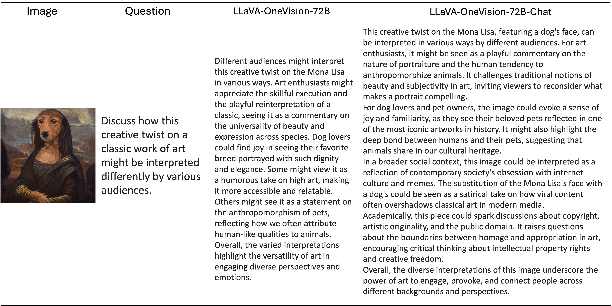

# LLaVA-OneVision-Chat: Improving Chat with Preference Learning

LLaVA-OneVision has demonstrated strong multimodal capabilities, showing excellent performance on various benchmarks in single-image, multi-image and video scenarios. However, we see potential for further improvement, particularly in its visual chat abilities. To achieve this, we've focused on enhancing the model through preference alignment, and our early experiments have produced some promising insights.

### Key Observations:

- **Impact of Alignment Learning**: By incorporating alignment learning—whether through human feedback or AI-generated feedback—we've observed a notable improvement in LLaVA-OneVision's chat experience. This progress is reflected in the significant performance gains recorded on both the LLaVA-W and WildVision benchmarks.
- **Success of Self-Generated Feedback**: In LLaVA-OneVision's case, leveraging self-generated feedback data has proven to be a highly effective strategy for enhancing its visual chat capabilities. This approach allows the model to refine its responses autonomously, leading to more natural and coherent conversations.

----

### Release

- Model Checkpoints: [[OV-7b-Chat]](https://huggingface.co/lmms-lab/llava-onevision-qwen2-7b-ov-chat) | [[OV-72b-Chat]](https://huggingface.co/lmms-lab/llava-onevision-qwen2-72b-ov-chat)
- Demo: [https://llava-onevision.lmms-lab.com](https://llava-onevision.lmms-lab.com/)

----

### Results

The figure below illustrates the performance gain of LLaVA-OV-Chat across 5 benchmarks. The delta numbers shown on top of the bars indicate the improvement of the chat model variant(7b/72b) over its base model LLaVA-OV. 

| Model Name          | WildVision | LLaVA-W | LLaVA-Wilder | LiveBench | Video Detailed Description |
|---------------------|------------|---------|--------------|-----------|----------------------------|
| LLaVA-OV-7b         | 54.0       | 90.7    | 67.8         | 77.1      | 3.75                       |
| LLaVA-OV-7b-Chat    | 67.3       | 100.3   | 71.6         | 84.5      | 3.87                       |
| LLaVA-OV-72b        | 51.7       | 93.5    | 72.0         | 81.5      | 3.60                       |
| LLaVA-OV-72b-Chat   | 70.0       | 104.4   | 75.9         | 88.5      | 3.86                       |
| GPT-4V              | 79.8       | 98.0    | 81.0         | 73.7      | 4.00                       |

LLaVA-OV-Chat consistently showcases exceptional visual chat capabilities across five open-ended multimodal tasks. Notably, compared to its base version, LLaVA-OV, which was trained using next-token prediction, LLaVA-OV-Chat—-enhanced through alignment learning-—receives significantly higher preference on four image-based tasks. The *[WildVision Bench](https://huggingface.co/datasets/WildVision/wildvision-bench)* simulates real-world multimodal interactions based on human preferences, mirroring scenarios from the online platform [WildVision-Arena (WV-Arena)](https://huggingface.co/spaces/WildVision/vision-arena). Both *[LLaVA-W](https://huggingface.co/datasets/lmms-lab/llava-bench-in-the-wild)* and *[**LLaVA-Wilder**](https://huggingface.co/datasets/lmms-lab/LLaVA-Bench-Wilder)* tackle daily-life visual tasks, with the former focusing on simpler cases and the latter on more challenging ones. The *[Multimodal Live-Bench](https://huggingface.co/spaces/lmms-lab/LiveBench)* leverages continuously updating news and online forums to test models' ability to generalize unobserved knowledge. Despite the alignment learning being conducted solely with images, LLaVA-OV-Chat also excels in [Video Detailed Captioning](https://llava-vl.github.io/blog/2024-04-30-llava-next-video/), demonstrating that its improved chat capabilities generalize effectively from image to video contexts.

#### Examples

Some qualitative examples are provided.

********

### Iterative DPO for Enhanced Performance

#### Feedback Data

To optimize LLaVA-OneVision’s in-the-wild conversational abilities, we've employed an iterative Direct Preference Optimization (DPO) process. Through this method, we found that feedback from two primary sources is particularly effective:

1. **Human Feedback from LLaVA-RLHF**: Real-world human input plays a crucial role in guiding the model toward more intuitive and user-friendly responses.

2. **AI Feedback from LLaVA-OV’s Self-Generated Responses**: Additionally, the AI's own self-generated feedback allows it to continuously improve and adapt, making this a valuable source for iterative learning.

By experimenting with either of these two forms of feedback, we've been able to significantly enhance LLaVA-OneVision's conversation capabilities, bringing it closer to achieving seamless visual chat interactions in dynamic, real-world environments.

#### Alignment Learning with Iterative DPO 

We provide a breakdown of the process for enhancing LLaVA-OneVision’s visual chat capabilities through iterative DPO.

#### Requirements:

1. **SFT Checkpoint**: We begin with a pretrained LLaVA-OneVision SFT (Supervised Fine-Tuning) model as the initial checkpoint for response generation.
2. **Preference Data**: The dataset used in our experiments consists of (language-image prompt, response, preference) pairs sourced from human feedback or AI feedback, which serves as the training data for the model to align with user preference to improve chat experience.

#### Step 1: Response Generation

For each langauge-image prompt in the dataset, we randomly generate \( k = 5 \) candidate responses from the starting checkpoint. To ensure diversity in the generated responses, we employ random decoding with the following parameters: Temperature = 0.7, Top-p (nucleus sampling) = 0.9. These settings encourage the generation of varied responses by balancing randomness and precision, giving us a broad spectrum of potential answers for further evaluation.

#### Step 2: Scoring and Acquiring Feedback Data

Once the candidate responses are generated, we utilize a feedback source (e.g., the Reward Model from LLaVA-RLHF) to score each of them. The reward model is responsible for evaluating the quality of the responses based on relevance, coherence, and appropriateness in relation to the given image-question pair. From the scored responses, we then select:

- The **best** response (highest score)
- The **worst** response (lowest score)

These two responses serve as **pairwise feedback data** for the next phase of the training process.

#### Step 3: Training with Iterative DPO

Using the feedback data obtained in `Step 2`, we conduct DPO training in an iterative fashion. The process is as follows:

1. In the $i^{th}$ round of training, we start with the pretrained model from the previous round $(i-1)^{th}$.
2. We generate new candidate responses by repeating the response generation process outlined in `Step 1`.
3. The reward source evaluates these new responses, and pairwise feedback data is acquired, as described in `Step 2`.
4. Finally, we apply DPO training to the model using the feedback data. Each round of DPO training lasts for **`1 epoch`**.

This iterative process is repeated for `N=3` rounds in total, with each round refining the model’s ability to generate high-quality visual chat responses by progressively incorporating feedback from both human and AI assessments.

------

Stay tuned on how we develop AI feedback for self-improvement LMMs!

*Contributors to LLaVA-OneVision-Chat: Tianyi Xiong, Bo Li, Huizhuo Yuan, Quanquan Gu, Chunyuan Li*