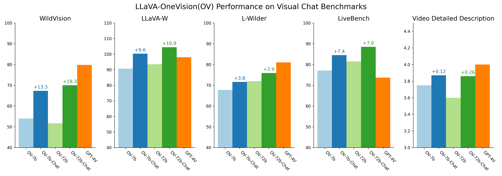

# LLaVA-OneVision-Chat: Improving Chat with Preference Learning

[LLaVA-OneVision](https://arxiv.org/abs/2408.03326) has demonstrated strong multimodal capabilities, showing excellent performance on various benchmarks in single-image, multi-image and video scenarios. However, we see potential for further improvement, particularly in its visual chat abilities. To achieve this, we've focused on enhancing the model through preference alignment, and our early experiments have produced some promising insights.

### Key Observations:

- **Impact of Preference Learning**: By incorporating alignment learning—whether through human feedback or AI-generated feedback—we've observed a notable improvement in LLaVA-OneVision's chat experience. This progress is reflected in the significant performance gains recorded on both the LLaVA-W and WildVision benchmarks.
- **Success of Self-Generated Feedback**: In LLaVA-OneVision's case, leveraging self-generated feedback data has proven to be a highly effective strategy for enhancing its visual chat capabilities. Specifically, [LLaVA-Critic](https://llava-vl.github.io/blog/2024-10-03-llava-critic/) is a utilized as a generalist evaluator to generate the scoring feedback for preference learning. This approach allows the model to refine its responses autonomously, leading to more natural and coherent conversations.

----

### Release

- 🤗 Model Checkpoints: [[OV-7b-Chat]](https://huggingface.co/lmms-lab/llava-onevision-qwen2-7b-ov-chat) | [[OV-72b-Chat]](https://huggingface.co/lmms-lab/llava-onevision-qwen2-72b-ov-chat)
- 💬 Demo: [https://llava-onevision.lmms-lab.com](https://llava-onevision.lmms-lab.com/)

----


### Results

The figure below illustrates the performance gain of LLaVA-OV-Chat across 5 benchmarks. The delta numbers shown on top of the bars indicate the improvement of the chat model variant(7b/72b) over its base model LLaVA-OV. 



| Model Name          | WildVision | LLaVA-W | LLaVA-Wilder | LiveBench | Video Detailed Description |
|---------------------|------------|---------|--------------|-----------|----------------------------|
| LLaVA-OV-7b         | 54.0       | 90.7    | 67.8         | 77.1      | 3.75                       |
| LLaVA-OV-7b-Chat    | 67.3       | 100.3   | 71.6         | 84.5      | 3.87                       |
| LLaVA-OV-72b        | 51.7       | 93.5    | 72.0         | 81.5      | 3.60                       |
| LLaVA-OV-72b-Chat   | 70.0       | 104.4   | 75.9         | 88.5      | 3.86                       |
| GPT-4V              | 79.8       | 98.0    | 81.0         | 73.7      | 4.00                       |

LLaVA-OV-Chat consistently showcases exceptional visual chat capabilities across five open-ended multimodal tasks. Notably, compared to its base version, LLaVA-OV, which was trained using next-token prediction, LLaVA-OV-Chat—enhanced through alignment learning—receives significantly higher preference on four image-based tasks. The *[WildVision Bench](https://huggingface.co/datasets/WildVision/wildvision-bench)* simulates real-world multimodal interactions based on human preferences, mirroring scenarios from the online platform [WildVision-Arena (WV-Arena)](https://huggingface.co/spaces/WildVision/vision-arena). Both *[LLaVA-W](https://huggingface.co/datasets/lmms-lab/llava-bench-in-the-wild)* and *[LLaVA-Wilder](https://huggingface.co/datasets/lmms-lab/LLaVA-Bench-Wilder)* tackle daily-life visual tasks, with the former focusing on simpler cases and the latter on more challenging ones. The *[Multimodal Live-Bench](https://huggingface.co/spaces/lmms-lab/LiveBench)* leverages continuously updating news and online forums to test models' ability to generalize unobserved knowledge. Despite the alignment learning being conducted solely with images, LLaVA-OV-Chat also excels in *[Video Detailed Captioning](https://llava-vl.github.io/blog/2024-04-30-llava-next-video/)*, demonstrating that its improved chat capabilities generalize effectively from image to video contexts.

#### Examples

|  Example 1 |
| -- |
| <div align="right" style="display: inline;"></div><div align="left" style="display: inline"><div><b>[Question]</b>: How likely is it to snow after this picture was taken? What would change with this type of tree before it's likely to snow? </div></div> |
| **[LLaVA-OneVision]**: It is highly unlikely that it would snow immediately after this picture was taken, as the lush green leaves suggest it's either late spring or summer. Before snowfall, which typically occurs in late autumn or winter, this type of tree, likely an oak, would shed its leaves, and the branches would appear bare. |
| **[LLaVA-OneVision-Chat]**: Given the lush green leaves and the overall vibrancy of the tree in the image, it is highly unlikely that snow would follow immediately. This type of tree, which appears to be a deciduous species, typically sheds its leaves in autumn as a preparation for winter. Before it's likely to snow, the tree would undergo several changes:<br><br>1. **Color Change**: The leaves would change color from green to shades of yellow, orange, red, or brown as the chlorophyll breaks down, revealing other pigments. <br>2. **Leaf Fall**: As the days shorten and temperatures cool, the tree would gradually shed its leaves. This process is triggered by hormonal changes within the tree that cause the cells at the base of each leaf to weaken and eventually break, allowing the leaves to fall.<br>3. **Dormancy**: The tree would enter a state of dormancy, during which its metabolic processes slow down significantly. This helps the tree conserve energy and survive the cold winter months.<br>4. **Bark Changes**: The bark may become more rugged and textured as the tree ages and prepares for winter. This is a natural defense mechanism against cold temperatures and potential pests.<br>5. **Root Activity**: The roots would continue to absorb water and nutrients until the ground freezes, after which they would go dormant as well.<br>6. **Snow Preparation**: Once the tree has shed its leaves and entered dormancy, it would be better prepared to withstand snow and ice accumulation on its branches without the added weight of leaves.<br><br>In summary, the tree would need to go through the full autumn cycle of leaf color change and fall, followed by entering dormancy, before it would be likely to snow. This process can take several weeks to a few months, depending on the specific species of the tree and the local climate conditions.|

|  Example 2 |
| -- |
| <div align="right" style="display: inline;"></div><div align="left" style="display: inline"><div><b>[Question]</b>: Discuss how this creative twist on a classic work of art might be interpreted differently by various audiences. </div></div>|
| **[LLaVA-OneVision]**: Different audiences might interpret this creative twist on the Mona Lisa in various ways. Art enthusiasts might appreciate the skillful execution and the playful reinterpretation of a classic, seeing it as a commentary on the universality of beauty and expression across species. Dog lovers could find joy in seeing their favorite breed portrayed with such dignity and elegance. Some might view it as a humorous take on high art, making it more accessible and relatable. Others might see it as a statement on the anthropomorphism of pets, reflecting how we often attribute human-like qualities to animals. Overall, the varied interpretations highlight the versatility of art in engaging diverse perspectives and emotions. |
| **[LLaVA-OneVision-Chat]**: This creative twist on the Mona Lisa, featuring a dog's face, can be interpreted in various ways by different audiences. For art enthusiasts, it might be seen as a playful commentary on the nature of portraiture and the human tendency to anthropomorphize animals. It challenges traditional notions of beauty and subjectivity in art, inviting viewers to reconsider what makes a portrait compelling.<br><br>For dog lovers and pet owners, the image could evoke a sense of joy and familiarity, as they see their beloved pets reflected in one of the most iconic artworks in history. It might also highlight the deep bond between humans and their pets, suggesting that animals share in our cultural heritage.<br><br>In a broader social context, this image could be interpreted as a reflection of contemporary society's obsession with internet culture and memes. The substitution of the Mona Lisa's face with a dog's could be seen as a satirical take on how viral content often overshadows classical art in modern media.<br><br>Academically, this piece could spark discussions about copyright, artistic originality, and the public domain. It raises questions about the boundaries between homage and appropriation in art, encouraging critical thinking about intellectual property rights and creative freedom.<br><br>Overall, the diverse interpretations of this image underscore the power of art to engage, provoke, and connect people across different backgrounds and perspectives. |

********

### Iterative DPO for Enhanced Performance

#### Feedback Data

To optimize LLaVA-OneVision’s in-the-wild conversational abilities, we've employed an iterative Direct Preference Optimization (DPO) process. Through this method, we found that feedback from two primary sources is particularly effective:

1. **Human Feedback from [LLaVA-RLHF](https://llava-rlhf.github.io/)**: Real-world human input plays a crucial role in guiding the model toward more intuitive and user-friendly responses.

2. **AI Feedback from LLaVA-OV’s Self-Generated Responses**: Additionally, the AI's own self-generated feedback allows it to continuously improve and adapt, making this a valuable source for iterative learning. [LLaVA-Critic](https://llava-vl.github.io/blog/2024-10-03-llava-critic/) is a utilized as a generalist evaluator to generate the scoring feedback for preference learning

By experimenting with either of these two forms of feedback, we've been able to significantly enhance LLaVA-OneVision's conversation capabilities, bringing it closer to achieving seamless visual chat interactions in dynamic, real-world environments.

#### Alignment Learning with Iterative DPO 

We provide a breakdown of the process for enhancing LLaVA-OneVision’s visual chat capabilities through iterative DPO.

##### Requirements:

1. **SFT Checkpoint**: We begin with a pretrained LLaVA-OneVision SFT (Supervised Fine-Tuning) model as the initial checkpoint for response generation.
2. **Preference Data**: The dataset used in our experiments consists of (language-image prompt, response, preference) pairs sourced from human feedback or AI feedback, which serves as the training data for the model to align with user preference to improve chat experience.

##### Step 1: Response Generation

For each langauge-image prompt in the dataset, we randomly generate `k = 5` candidate responses from the starting checkpoint. To ensure diversity in the generated responses, we employ random decoding with the following parameters: `temperature = 0.7`, `top-p (nucleus sampling) = 0.9`. These settings encourage the generation of varied responses by balancing randomness and precision, giving us a broad spectrum of potential answers for further evaluation.

##### Step 2: Scoring and Acquiring Feedback Data

Once the candidate responses are generated, we utilize a feedback source (e.g., the reward signals from LLaVA-RLHF or reward signals from LLaVA-Critic) to score each of them. The reward model is responsible for evaluating the quality of the responses based on relevance, coherence, and appropriateness in relation to the given image-question pair. From the scored responses, we then select:

- The **best** response (highest score)
- The **worst** response (lowest score)

These two responses serve as **pairwise feedback data** for the next phase of the training process.

##### Step 3: Training with Iterative DPO

Using the feedback data obtained in `Step 2`, we conduct DPO training in an iterative fashion. The process is as follows:

1. In the $i^{th}$ round of training, we start with the pretrained model from the previous round $(i-1)^{th}$.
2. We generate new candidate responses by repeating the response generation process outlined in `Step 1`.
3. The reward source evaluates these new responses, and pairwise feedback data is acquired, as described in `Step 2`.
4. Finally, we apply DPO training to the model using the feedback data. Each round of DPO training lasts for **`1 epoch`**.

This iterative process is repeated for `N=3` rounds in total, with each round refining the model’s ability to generate high-quality visual chat responses by progressively incorporating feedback from both human and AI assessments.

**Training script and data format**

- Example training script: [`/scripts/train/dpo_ov7b.sh`](../scripts/train/dpo_ov7b.sh)
- Format of training data:
~~~json
{
  "id": "<image-id>",
  "image": "<image path under args.image_folder>",
  "prompt": "<input prompt/question>",
  "chosen": "<chosen model response>",
  "rejected": "<rejected model response>"
}
~~~


------

Check out on how we develop AI feedback for self-improvement LMMs, using [LLaVA-Critic](https://llava-vl.github.io/blog/2024-10-03-llava-critic/) as a generalist evaluator to generate the scoring feedback for preference learning!

*Contributors to LLaVA-OneVision-Chat: [Tianyi Xiong](https://tyxiong23.github.io/), [Bo Li](https://brianboli.com/), [Dong Guo](https://www.linkedin.com/in/dongguoset/), [Huizhuo Yuan](https://scholar.google.com/citations?user=8foZzX4AAAAJ), [Quanquan Gu](https://web.cs.ucla.edu/~qgu/), [Chunyuan Li](https://scholar.google.com/citations?user=Zd7WmXUAAAAJ)*


### Citation

If you find it useful for your research and applications, please cite related papers/blogs using this BibTeX:
```bibtex
@misc{xiong2024llavaovchat,
  title={LLaVA-OneVision-Chat: Improving Chat with Preference Learning},
  url={https://github.com/LLaVA-VL/LLaVA-NeXT/blob/main/docs/LLaVA_OneVision_Chat.md},
  author={Xiong, Tianyi and Li, Bo and Guo, Dong and Yuan, Huizhuo and Gu, Quanquan and Li, Chunyuan},
  month={September},
  year={2024}
}

@article{xiong2024llavacritic,
  title={LLaVA-Critic: Learning to Evaluate Multimodal Models},
  author={Xiong, Tianyi and Wang, Xiyao and Guo, Dong and Ye, Qinghao and Fan, Haoqi and Gu, Quanquan and Huang, Heng and Li, Chunyuan},
  year={2024},
  eprint={2410.02712},
  archivePrefix={arXiv},
  primaryClass={cs.CV},
  url={https://arxiv.org/abs/2410.02712},
}

@article{li2024llavaov,
  title={Llava-onevision: Easy visual task transfer},
  author={Li, Bo and Zhang, Yuanhan and Guo, Dong and Zhang, Renrui and Li, Feng and Zhang, Hao and Zhang, Kaichen and Li, Yanwei and Liu, Ziwei and Li, Chunyuan},
  journal={arXiv preprint arXiv:2408.03326},
  year={2024}
}

@article{sun2023aligning,
  title={Aligning large multimodal models with factually augmented rlhf},
  author={Sun, Zhiqing and Shen, Sheng and Cao, Shengcao and Liu, Haotian and Li, Chunyuan and Shen, Yikang and Gan, Chuang and Gui, Liang-Yan and Wang, Yu-Xiong and Yang, Yiming and Keutzer, Kurt and Darrell, Trevor},
  journal={arXiv preprint arXiv:2309.14525},
  year={2023}
}
```


